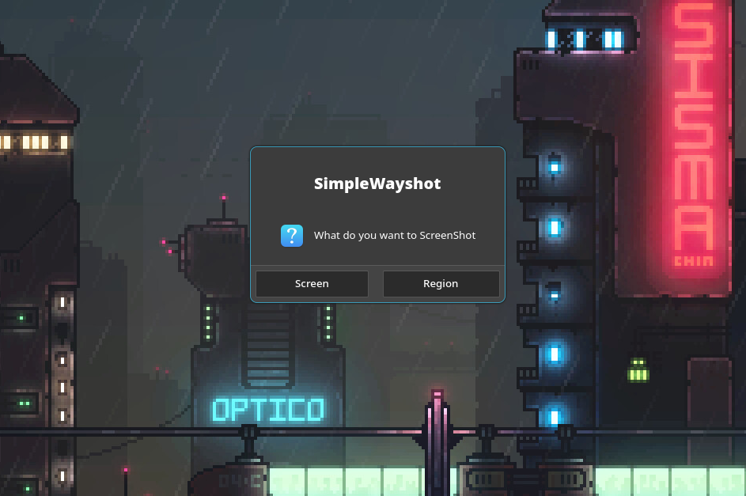

# Description
Simple bash script that puts together multiple tools that allows you to take ScreenShots in Wayland.

  > ***Note:*** This has only been tested in Arch Based Distros. 
  
# Install
First install the following dependencies ***(Important)***:
  * grim - Terminal based tool to take screenshots.
  * slurp - Allows to select a region of the screen.
  * zenity - Basic gtk dialog windows.
  * wlr-randr - To Manage display settings.

Quick installation commands:
  * From Arch official repositories:
    ```bash
    sudo pacman -S grim slurp zenity wlr-randr
    ```
Get the repo:
  * Clone the repo
    ```bash
    git clone --depth 1 https://github.com/danielpolov/simplewayshot.git \
    $HOME/.local/share/apps/simplewayshot
    ```
  * Jump into folder:
    ```bash
    cd ~/.local/share/apps/simplewayshot
    ```
  * Make ***simplewayshot.sh** executable
    ```bash
    chmod +x ./simplewayshot.sh
    ```
# How to use
Create a keybind. Example in hyprland:
  ```plaintext
  bind = SUPER SHIFT, D, exec, ~/.local/share/apps/simplewayshot/simplewayshot.sh
  ```
Example in SwayWM:
  ```plaintext
  bindsym Mod4+Shift+d ~/.local/share/apps/simplewayshot/simplewayshot.sh
  ```
When executing it this is what you'll see.

